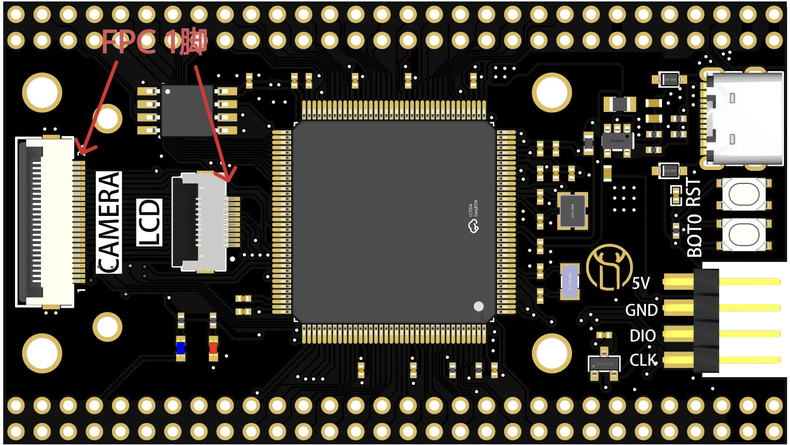
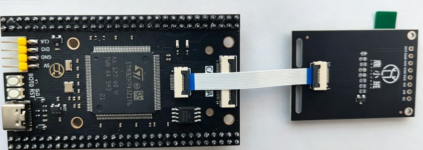

# h723-mini — STM32H723ZGT6 development projects

Board folder of the **h7-demo** repo (one top-level folder per board; this is
the first). Firmware projects for the h723-mini board (STM32H723ZGT6 @ 550 MHz,
USART1 console on PA9/PA10, LED on PG7 low-active, 1.54" 240x240 ST7789 LCD,
ST-Link V2 SWD probe).





## Board (hardware)

* MCU: STM32H723ZGT6 (LQFP144, 1 MB flash, 550 MHz max).
* HSE: 25 MHz external crystal.
* LED: **PG7, low active** (`GPIO_PIN_RESET` = ON).
* USART1 console: PA9 (TX) / PA10 (RX), AF7, 115200 8-N-1.
* LCD: 1.54" 240x240 ST7789 (SPI6: PG8 CS, PG13 SCK, PG14 MOSI, PG15 DC, PG12
  backlight via TIM23_CH1 PWM).
* W25Q64 (8 MB) SPI flash on OCTOSPI1 port 1 (PF6-10, PG6).
* Debug probe: **ST-Link V2 (SWD)** — the ULINK2 unit on hand did not work on
  this board (a local observation, not a rigid test), so the ST-Link V2 is
  used for flashing. The console is **not** on the ST-Link: USART1 goes to the
  board's USB-serial bridge (a CH340, `COM89` on this machine).

## Clock tree (550 MHz)

```
HSE 25 MHz → PLL1 (M=10, N=220, P=1) → SYSCLK 550 MHz
  AHB /2  → HCLK 275 MHz
  APB1/2/3/4 /2 → 137.5 MHz
  VOS scale 0 (1.35 V), flash latency 3
```

Copied verbatim from the vendor `1.LED闪烁` 550 MHz example. The board's own
`cubemx_file/cubemx_file.ioc` (16 MHz-HSE based PLL values) does NOT match
the 25 MHz crystal and is not used by these builds.

## Projects

The tree: `bare/` (bare-metal apps running from internal flash), `app_qspi/`
(the same apps linked at `0x90000000` and running from the W25Q64), `board/`
(shared board layer), `cmake/` (toolchain/board helpers), `drivers/` (the
STM32H7 HAL + CMSIS pulled from the vendor example projects), `cubemx_file/`
(the board's vendor CubeMX `.ioc`).

**`bare/` (bare-metal, internal flash):**
| Project                | What it is                                     |
| ---------------------- | ---------------------------------------------- |
| `blink_hello`          | LED blink (PG7) + UART (reference template)    |
| `dhry_550m`            | Dhrystone 2.1 benchmark @ 550 MHz              |
| `coremark_550m`        | CoreMark 1.0 @ 550 MHz                         |
| `st7789_md154_240x240` | 1.54" 240x240 ST7789 LCD demo (SPI6)           |
| `hse_test`             | HSE crystal check (boots on HSI 64 MHz)        |
| `spi_flash_test`       | W25Q64 OCTOSPI flash benchmark + XIP demo      |

**`app_qspi/` (pure QSPI — code runs from the W25Q64 @ 0x90000000):**
| Project                | What it is                                     |
| ---------------------- | ---------------------------------------------- |
| `blink_hello`          | LED blink from the W25Q64                      |
| `dhry_550m`            | Dhrystone 2.1 from the W25Q64                  |
| `coremark_550m`        | CoreMark 1.0 from the W25Q64                   |
| `st7789_md154_240x240` | 1.54" 240x240 ST7789 LCD demo from the W25Q64  |

**`tool/` (boot + infra):**
| Project      | What it is                                             |
| ------------ | ------------------------------------------------------ |
| `h723_boot`  | Minimal bootloader: checks 0x90000000, memory-maps + jumps |
| `qspi_map`   | Two-stage boot + app + the probe-rs OCTOSPI flash algorithm |
| `probers_alg`| Harness: runs the OCTOSPI algorithm's register code as firmware |

Benchmark results (measured on this board, 550 MHz, hard-float, I/D caches on)
live in the project READMEs — `bare/dhry_550m`, `bare/coremark_550m` and their
`app_qspi/` twins — **for all three toolchains**: gcc (default), armclang (Keil
AC6) and starm-clang (ST Arm Clang from STM32CubeIDE), selected with
`-DSTM32_TOOLCHAIN=...`. Highlights: **armclang `-Omax -fno-lto` is fastest on
CoreMark** (2865.66 vs GCC's 2440.93 it/s) and on Dhrystone (2.934 vs 2.723
DMIPS/MHz); ST Arm Clang is slower on CoreMark (2064.75) and level on Dhrystone
(2.736). The flags and the `BENCH_OPT` / `BENCH_OPT_C` / `STM32_LTO` knobs are
borrowed from the nano-f411 "f4-demo" benchmarks: `-funroll-all-loops` gives
CoreMark +2.9% (2372.59 → 2440.93) while **LTO costs 6.2%** on this board (the
F411 gained from it) and stays off. A helper to flash + capture the console for
a benchmark run is in `../tools/bench_capture.sh` (pass `PORT=COM89` — the
board's CH340 USB-serial bridge carries USART1).

Verified on hardware:

* `st7789_md154_240x240` drives the on-board 1.54" panel over SPI6 (PG8/13/14, 68.75 MHz SCK,
  DC PG15 — vendor `1.54寸240x240分辨率` pinout) with a **TIM23_CH1 PWM
  backlight on PG12** (`lcd_bl_bright_set`), and loops shapes → pure colors →
  gradient → LED test with an on-screen FPS counter.
* `hse_test` reports `HSE: READY - crystal OK` (the 25 MHz HSE locks).
* `spi_flash_test` drives the on-board W25Q64 (8 MB) over OCTOSPI1 port 1
  (PF6-10, PG6, 137.5 MHz) — erase/write/read throughput in every line mode,
  memory-mapped reads up to **65.6 MiB/s** (1-4-4), and an **XIP** demo that
  executes code from `0x90000000` (all checksums OK).
* `h723_boot` (internal flash) runs at 550 MHz, initializes the W25Q64 via
  OCTOSPI, and boots a stage-2 app from `0x90000000` when present.

## QSPI / OCTOSPI status

✅ **Fully working**: the `app_qspi/` apps link at `0x90000000`, `ninja flash`
programs them into the W25Q64 via the **probe-rs OCTOSPI flash algorithm**
(`tool/qspi_map/algo/`), and `h723_boot` boots them at 550 MHz. Verified on
hardware: `app_qspi/blink_hello` (LED + console) and `app_qspi/dhry_550m`
(**2.722 DMIPS/MHz from external flash — identical to internal flash**).
The algorithm's write path (`ProgramPage`) was debugged with
`tool/probers_alg` and fixed — see `tool/qspi_map/algo/README.md` for the
root causes (FMODE = indirect write is `0b00`, command-only transfers
auto-start, wait for TCF).

The HAL/CMSIS under `drivers/` was copied from the vendor project
`board_database\main-stm32h723-mini\vendor_projects\1.LED闪烁` (CubeMX
STM32Cube FW_H7) — the projects only exercise the RCC/GPIO/FLASH/PWR/
CORTEX/HSEM/UART HAL modules.

## Build & flash

Each project has `build.sh` (GNU arm-none-eabi-gcc, the default). The benchmark
projects additionally support **armclang** (Keil AC6) and **starm-clang** (ST Arm
Clang from STM32CubeIDE) via `-DSTM32_TOOLCHAIN=<gcc|armclang|starm-clang>`; use
a separate build dir per toolchain (`build-ac6/`, `build-starm/` — the toolchain
file is cached). The build outputs the `.elf` + `.hex`; `ninja flash` programs
the board via **probe-rs**, and `ninja dfu-flash` via USB DFU (fallback):

```bash
cd bare/blink_hello
bash build.sh
ninja probes        # what can probe-rs see right now? (probe-rs list)
ninja flash         # probe-rs auto-detects the connected probe
ninja flash-stlink  # ... or use the attached ST-Link (V2 / V2-1 / V3)
ninja flash-dap     # ... or the attached CMSIS-DAP probe (DAPLink / mbed / ...)
ninja flash-jlink   # ... or the attached SEGGER J-Link
ninja flash-ulink   # explains why ULINK cannot be automated here (see below)
ninja dfu-flash     # USB DFU via STM32CubeProgrammer (needs BOOT0=1 + reset)
```

Probe selection (full story in `cmake/probe-select.cmake`):

* `ninja flash` passes no `--probe`, so **probe-rs itself auto-detects** the
  probe. That fails if several probes are attached — use a family target then.
* `ninja flash-<family>` uses the first attached probe of that family, resolved
  from `probe-rs list` **at configure time** (`VID:PID:SERIAL`, or `VID:PID` for
  probes that report no serial). Swapped probes? Re-run cmake.
* `-DDEBUG_PROBE=VID:PID[:SERIAL]` pins one probe for every target;
  `PROBE_RS_PROBE=...` does the same for a single run. A pin that is not
  attached is reported and ignored (it used to make every target fail with
  "No connected probes were found").
* `flash-ulink` only explains: **probe-rs has no ULINK driver**, and neither has
  openocd nor pyOCD, so a ULINK2 must be driven by Keil uVision itself
  (`Flash -> Download`, or `UV4 -s <cmd.uvs>`, with a `.uvprojx` whose Flash
  Download settings use the ULINK2). The ULINK2 unit on hand did not flash this
  board (a local observation, not a rigid test).

Equivalent command lines for driving a tool directly (probe-rs and ST's CLI are
the ones verified on this board):

```bash
probe-rs download --probe 0483:3748 --chip STM32H723ZG --protocol swd \
    --binary-format hex --verify --reset app.hex          # any probe-rs probe
STM32_Programmer_CLI -c port=SWD mode=UR -d app.hex -v    # ST's own CLI (works)
# SEGGER's own tool (installed at D:/Program Files/SEGGER/JLink_V956/JLink.exe;
# note `jlink` on PATH is the JDK tool, not this one) - template, needs a script:
#   si SWD / speed 4000 / device STM32H723ZG / connect / loadfile app.hex / r / g / qc
JLink.exe -device STM32H723ZG -if SWD -speed 4000 -autoconnect 1 -CommanderScript flash.jlink
openocd -f interface/cmsis-dap.cfg -f target/stm32h7x.cfg \
    -c "program app.hex verify reset exit"                # CMSIS-DAP via openocd
```

> Do **not** use `--connect-under-reset` with this ST-Link V2 under probe-rs
> 0.32: the under-reset attach never asserts nRST (`RCC_RSR` shows no `PINRSTF`
> afterwards), so the chip is not reset and probe-rs times out waiting for the
> core to halt — `Timeout while attaching to target under reset`. A plain attach
> halts the core, which is all these flash targets need.

Then open the USART1 console at 115200 8-N-1 — the board's USB-serial bridge
(a CH340; `COM89` on this machine, the number varies per machine). `tools/serial_capture.py`
(or `tools/bench_capture.sh`, which also flashes) prints what arrives.

### Troubleshooting: `CreateProcess failed` during a CMake re-run

If `ninja` stops with

```text
[0/1] Re-running CMake...
/usr/bin/cmake.exe --regenerate-during-build -S... -B...
CreateProcess failed: The system cannot find the file specified.
ninja: error: rebuilding 'build.ninja': subcommand failed
```

the build directory was configured by the **MSYS** cmake, which records
`CMAKE_COMMAND=/usr/bin/cmake.exe`; the native mingw64/Windows `ninja` cannot
spawn that POSIX path. Run `ninja` from the same MSYS shell, or delete `build/`
and reconfigure — every project's `build.sh` now puts `/mingw64/bin` first, so
the build dir it creates records a Windows cmake path and works from any shell.
(Keep cmake and ninja the *same* flavour: an MSYS ninja cannot run the cmd.exe
rules a native cmake emits - it fails with
`/bin/sh: line 1: C:WINDOWSsystem32cmd.exe: command not found` - and a native
ninja cannot run an MSYS cmake re-run.)
