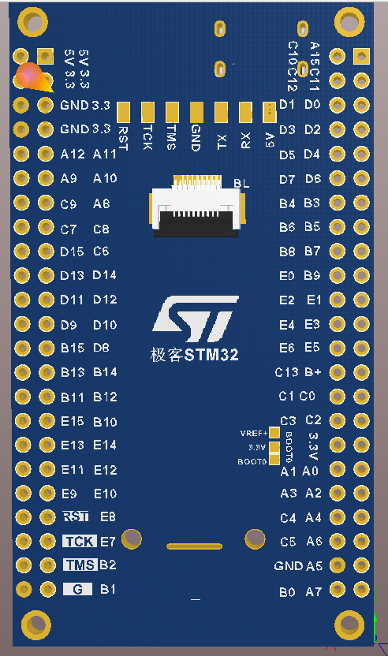

# h750-mini — STM32H750VBT6 development board

Board-level documentation and repo map for the **h750-mini** board (one of the
boards in the [h7-demo](../README.md) repo). Project-level docs live in each
project folder; board/chip-level info lives here.



## Chip: STM32H750VBTx
- Cortex-M7 (single core) @ 480 MHz, FPU, DSP, **2 MB flash** physically present
  (the part is a shadow STM32H743 die — confirmed on hardware, see
  [`bare/h743_verify`](bare/h743_verify/)).
- Memory layout used by these projects:
  - DTCM 128 KB @ `0x20000000` — stack + heap + `.data`/`.bss`
  - ITCM 64 KB @ `0x00000000`
  - AXI SRAM 512 KB @ `0x24000000` — camera DMA buffer at `0x24000000`
  - D2 SRAM1-3 288 KB @ `0x30000000`, SRAM4 64 KB @ `0x38000000`
- Clocks: HSE 25 MHz -> PLL1 -> SYSCLK 480 MHz (MCO2 outputs 480 MHz). The
  board's HSE crystal is **marginal** — see
  [HSE vs HSI](#clock-source-hse-vs-hsi--status-of-this-board).
- Debug: SWD via Keil **ULINK2** (VID `0xC251`, PID `0x2722`, serial
  `V0010M9E`), which enumerates as a **CMSIS-DAP** probe. This ULINK2 is
  confirmed **not** to support SWO/ITM trace, so the console is USART1.

## Board peripherals in use
| Periph | Pins | Use |
| ------ | ---- | --- |
| DCMI | PA4 HSYNC, PA6 PCLK, PB7 VSYNC, PC6-PC7/PD3/PE0-PE1/PE4-PE6 D0-D7 | OV5640 8-bit capture -> DMA1_Stream0 -> AXI SRAM |
| SCCB (bit-banged) | PB8 SCL, PB9 SDA | OV5640 register access |
| OV5640 control | PD14 PWDN, PD0 LEDEN, PE3 GPIO_IN | camera power / flash |
| SPI4 | PE11 NSS, PE12 SCK, PE14 MOSI | ST7789 **2.0" 240x320** RGB LCD (60 MHz, prescaler 2) |
| LCD DC | PE15 | data/command select |
| USART1 | PA9 TX, PA10 RX | console printf @ 115200 via on-board CH340 (`COM56`) |
| QUADSPI | PB2 CLK, PB6 NCS, PD11-PD13/PE2 IO0-3 | W25Q64 (the `app_qspi/` apps execute from here) |
| TIM4 CH4 | PD15 | LCD backlight PWM (used by the ST7789 demos) |
| ADC3 | - | (configured by CubeMX; not used by the apps) |

## Folder layout

| Folder | What is in it |
| ------ | ------------- |
| `bare/` | applications that run from the internal flash |
| `app_qspi/` | pure-QSPI applications — code runs from the W25Q64 at `0x90000000` |
| `board/` | shared board support: 480 MHz clock init, USART1 console, SWV helper, newlib stubs, startup file, linker script |
| `board_images/` | board photos used by this README |
| `cmake/` | shared CMake modules: toolchain files, the board layer, internal-flash + QSPI flash targets, custom probe-rs chip definitions |
| `cubemx_file/` | the CubeMX/Keil project (`.ioc`, `Core/`, `MDK-ARM/`) — **also the shared HAL/CMSIS source** for all CMake projects here (see its [README](cubemx_file/README.md)) |
| `tool/` | boot/infrastructure firmware (`h750_boot`, `qspi_map`, `probers_alg`) plus the host helper scripts (`build.sh`, `flash.sh`, openocd configs, QSPI UART download) |

Unlike h723-mini, this board has **no separate `drivers/` folder**: the HAL and
CMSIS sources live inside the CubeMX project (`cubemx_file/Drivers`), because
that project is also built by Keil MDK and must keep its layout.

## Projects

**`bare/` (internal flash):**
| Project | What it is |
| ------- | ---------- |
| `blink_hello` | LED blink + UART (reference) |
| `dhry_480m` | Dhrystone 2.1 benchmark @ 480 MHz |
| `coremark_480m` | CoreMark 1.0 @ 480 MHz |
| `st7789_md200_240x320` | ST7789 2.0" 240x320 LCD demo (SPI4 + backlight PWM) |
| `ov5640_to_st7789` | camera + display reference (GCC build reusing the CubeMX sources) |
| `spi_flash_test` | W25Q64 QUADSPI driver + read/write/XIP benchmarks |
| `hse_test` | HSE feasibility check (boots on HSI, reports HSE ready/fail) |
| `h743_verify` | 2 MB internal-flash check |

**`app_qspi/` (pure QSPI — code runs from the W25Q64):**
| Project | What it is |
| ------- | ---------- |
| `blink_hello` | LED blink from QSPI |
| `dhry_480m` | Dhrystone from QSPI |
| `coremark_480m` | CoreMark from QSPI |
| `st7789_md200_240x320` | ST7789 LCD test from QSPI |
| `ov5640_to_st7789` | camera + display from QSPI (the non-board-layer conversion example) |

**`tool/` (boot + infra + host helpers):**
| Project | What it is |
| ------- | ---------- |
| `h750_boot` | minimal bootloader: basic check of `0x90000000`, jump, else LED+print loop |
| `qspi_map` | two-stage boot + app + the probe-rs W25Q64 flash algorithm |
| `probers_alg` | harness: runs the QUADSPI algorithm's register code as a firmware with printf |

> **h750_boot's bootability check is basic by design.** It only verifies that
> word 0 of the QSPI firmware (initial SP) lands in the DTCM region
> `0x20000000..0x24000000` and word 1 (reset vector) is a thumb pointer inside
> `0x90000000..0x90800000`. This is a garbage-rejection heuristic, not a
> hardware or linker requirement:
> - An app whose stack lives in AXI SRAM (`0x24000000+`), SRAM1/2/3
>   (`0x30000000+`) or SRAM4 (`0x38000000`) would be **rejected** even though
>   those are valid stacks. The shipped QSPI apps all use DTCM, so they pass.
> - The bootloader itself is a basic demo — if an app's layout doesn't satisfy
>   the heuristic, either modify the bootloader's check or the app's linker
>   script. The bootloader prints this note on every FAIL.

> Embedded-flash vs QSPI projects differ only in three switches (linker script,
> system-init/clock ownership, flash target) — see
> **[EMBEDDED_VS_QSPI.md](EMBEDDED_VS_QSPI.md)** for the practical conversion
> guide, and **[QSPI_APP_GUIDE.md](QSPI_APP_GUIDE.md)** for flashing/booting a
> pure-QSPI app.

## Clock source: HSE vs HSI — status of this board

The board's external 25 MHz crystal (HSE) is **marginal**. During an extended
hard-fault/benchmark session the HSE got stuck (`RCC_CR` = `HSEON=1`,
`HSERDY=0` forever), which made every HSE-based firmware hang in
`SystemClock_Config()`.

**`bare/hse_test` proves the crystal is functional**: it boots on the internal
HSI (64 MHz) and then enables HSE with a bounded wait:

```
HSE: READY - crystal OK (RCC_CR=0x0003c025)
```

So the recovery is: **boot on HSI first, then start HSE** (do not try to start
HSE as the very first thing). After that, the normal HSE-based firmware
(`h750_boot`, the benchmarks) boots at 480 MHz again.

If HSE ever becomes unreliable again, the plan is to run everything from HSI
(internal RC, 64 MHz, optionally PLL1 ×~7.5 → up to 480 MHz with a marginal
960 MHz VCO, or a safe 240 MHz). Projects would be renamed `**_hsi_max`.

## The 2 MiB flash (shadow-STM32H743 rumor) — confirmed

The STM32H750VBT6 is officially 128 KB flash, but the part on this board is a
**shadow STM32H743VIT6 die**: the factory `FLASH_SIZE` register (`0x1FF1E880`)
reports 128 KB, yet the full **2 Mbyte** of flash is physically present.

`bare/h743_verify` proved it end-to-end on hardware: a firmware image with a
15 × 128 KB probe array pinned at `0x08020000` (covering the whole 2 MB span
through `0x081FFFFF`, each sector with a distinct fill byte) flashed via
`probe-rs --chip STM32H743VI`, and every sector program-verified and read back
OK (`15/15 sectors OK -> FLASH PRESENT (full 2 MB readback OK)`). See
[`bare/h743_verify/`](bare/h743_verify/).

### Using the full 2 MB in a new project

1. **Linker script**: declare `FLASH = 2M` (copy
   `bare/h743_verify/h743_verify.ld` or set
   `FLASH (rx) : ORIGIN = 0x08000000, LENGTH = 2M` in the shared
   `stm32h750_board.cmake` script override). That project sets
   `H750_LINKER_SCRIPT` to its 2M script before including the board layer.
2. **Flash tool**: the H750 target definition only knows 128 KB and will
   refuse images over it — flash with the H743 definition instead:
   `CHIP=STM32H743VI bash ../tools/bench_capture.sh <hex> <secs> <label>`
   (or `ninja flash` after setting `-DPROBE_RS_CHIP=STM32H743VI`).
3. `probe-rs` enforces the chip definition's size, so the H750 def is a safe
   guardrail; `openocd` is *not* — it reads `FLASH_SIZE` (128 KB) and silently
   drops any data past `0x0801FFFF` while still reporting "Verified OK" (see
   the flasher benchmark below).

## Benchmarks @ 480 MHz (hard-float, caches on)

Measured on hardware via the USART console (see each project's README).

| Benchmark | Toolchain | Score | DMIPS/MHz |
| --------- | --------- | ----- | --------- |
| Dhrystone 2.1 | GCC 15.3.1 | 2,296,651 Dhrystones/s | 2.723 |
| Dhrystone 2.1 | armclang 20.0.0git | 2,474,227 Dhrystones/s | 2.934 |
| Dhrystone 2.1 | GCC 15.3.1 + LTO | 4,897,959 Dhrystones/s (⚠) | 5.808 (⚠) |
| CoreMark 1.0 | GCC 15.3.1 | 2070.56 CoreMark | — |
| CoreMark 1.0 | armclang 20.0.0git | 2089.95 CoreMark | — |

> ⚠ The LTO Dhrystone number is **invalid**: `-flto` lets GCC hoist
> loop-invariant work out of the timed loop, inflating the score 2.13× while
> still passing the final-value check (same artifact as on the F407 port).
> Never use LTO for Dhrystone scoring.

Reference (F407, 168 MHz, same flags): GCC 351,370 D/s / 1.190 DMIPS/MHz,
armclang 393,391 D/s / 1.333 DMIPS/MHz.

### QSPI vs internal-flash benchmark results (480 MHz, GCC 15.3.1, I-cache on)

Re-verified after re-flashing both QSPI images with the hardware-QUADSPI flash
algorithm (`target_w25q64_qspi.yaml`):

| Benchmark | Internal flash | W25Q64 (QSPI) | Delta |
| --------- | -------------- | ------------- | ----- |
| Dhrystone (Dhrystones/s) | 2,296,650.75 | 2,296,650.75 | 0.0 % |
| CoreMark 1.0 | 2070.565 | 2064.58 | ~0.29 % |

Both run from QSPI at essentially full speed: the hot loops are cache-resident,
so the memory-mapped QSPI fetch latency is hidden. The Dhrystone equality is
exact (both report 2,296,650.75); CoreMark is ~0.3 % slower from QSPI.

## External QSPI flashing (W25Q64)

The probe-rs flash algorithms live in `tool/qspi_map/algo/`
(position-independent, run on HSI from RAM). All are **self-verifying**
(read-back verifies every page program + sector erase, retries on mismatch).
See [QSPI_APP_GUIDE.md](QSPI_APP_GUIDE.md) for how to flash and boot a
pure-QSPI app. Every `app_qspi/` project has a **`ninja flash`** target that
builds the `.hex` and flashes the W25Q64 via the QUADSPI algorithm,
auto-generating the algorithm YAML if it is missing/stale:

| Algorithm | Technology | 41 KB flash time |
| --------- | ---------- | ---------------- |
| `flash_w25q64_qspi.c` (`target_w25q64_qspi.yaml`) | **Hardware QUADSPI** (manual GPIO CS + word FIFO) | **~5 s** |
| `flash_w25q64_fast.c` (`target_w25q64_fast.yaml`) | fast bit-banged SPI | ~6 s |
| `flash_w25q64.c` (`target_w25q64.yaml`) | plain bit-banged SPI | ~14 s |

(Use `python build_algo.py flash_w25q64_qspi.c 0x4000` etc.; the second arg is
the probe-rs `page_size`. A large chunk matters — probe-rs's per-`ProgramPage`
call overhead, not SPI speed, was the original bottleneck.)

The QUADSPI variant was debugged to completion with the `qspi_alg_test`
harness. The key discoveries: the QUADSPI's **NCS is hi-Z when idle** and PB6
has an external pull-down on this board (flash stays selected →
continuous-read), so **CS is driven manually as a GPIO** around each transfer;
and the **DR FIFO must be read/written as 32-bit words** (byte accesses don't
pop/push it). Runs on HSI at ~16 MHz QSPI with no PLL.

## Internal-flash flashing speed (custom page_size)

probe-rs's built-in STM32H750/H743 internal flash algorithm uses a **1 KB
page_size**, so its per-`ProgramPage`-call overhead dominates just like the
external flash. `cmake/stm32h750_custom.yaml` and `cmake/stm32h743_custom.yaml`
are exact copies of the built-in chip definitions with `page_size: 0x4000`
(16 KB) and `program_page_timeout: 2000`. The `ninja flash` target uses them
automatically for `STM32H750VB` / `STM32H743VI`. Measured (no `--verify`):

| Image | Built-in (1 KB pages) | Custom (16 KB pages) | Delta |
| ----- | --------------------- | -------------------- | ----- |
| 41 KB (dhry) internal flash | 8.9 s | 6.5 s | ~27 % |
| 1.9 MB on the 2 MiB shadow flash (H743VI def) | 283 s | 154 s | ~45 % |

The 16 KB-page write is byte-perfect (`h743_verify` reported
`15/15 sectors OK, FLASH PRESENT`).

## Toolchains

- CMake default: **`arm-none-eabi-gcc` 15.3.1** (GNU toolchain 13.3.Rel1 dir),
  CMake 3.30.0, Ninja. Every project has its own `build.sh`.
- **armclang** (Keil MDK ARMCLANG V6.24) for the CMake projects via
  `-DSTM32_TOOLCHAIN=armclang`
  (`cmake/armclang-keil-toolchain.cmake`; use a separate build dir such as
  `build-ac6/` — the toolchain file is cached), and the Keil uVision project
  under `cubemx_file/MDK-ARM/`.
- Flashing: **`probe-rs`** (0.32.0) + ULINK2 over SWD
  (`$HOME/.cargo/bin/probe-rs.exe`), wrapped by the `ninja flash` target and
  `tool/flash.sh`.
- Alternative flasher: `openocd` (xPack OpenOCD 0.12.0+dev, the
  `xpack-dev-tools.openocd-xpack` WinGet package). Board config:
  `tool/openocd_ulink2.cfg` (CMSIS-DAP, serial `V0010M9E`) and
  `tool/openocd_qspi_h750.cfg` for the QUADSPI.
- Serial capture: pyserial 3.5 on `COM56` @ 115200, via the shared
  `../tools/serial_capture.py`.

## Flasher benchmark (ULINK2 / SWD)

| Image (bin) | openocd (CMSIS-DAP) | probe-rs |
| ----------- | -------------------- | -------- |
| `blink_hello` (~19 KB) | **2.8 s** program+verify | 8.5 s |
| 2 MB `h743_verify` (~1.9 MB) | **cannot flash** (128 KB cap) | **396 s** (~6.6 min) |

- `openocd` is faster on small images but is **capped at 128 KB** on this part:
  its `stm32h7x` driver sizes the bank from the binned `FLASH_SIZE` register
  (`flash size probed value 128k`). Worse, flashing a >128 KB image it prints
  `no flash bank found for address 0x08030000`, drops that data, and still
  reports `Programming Finished / Verified OK` — a silent partial flash.
- `probe-rs` bypasses the binned size via its target definition and is the only
  one of the two that can program large images, so **`probe-rs` remains the
  `ninja flash` default**.
- A dedicated flash script for openocd is not wired into the CMake targets
  because of the partial-flash hazard above.

## Build & flash

Every project builds the same way (per-project `build.sh` wraps these steps):

```sh
cd h750-mini/bare/ov5640_to_st7789
bash build.sh                       # or: cmake -G Ninja -B build && cmake --build build
ninja flash                         # probe-rs + ULINK2 (SWD) -> internal flash
ninja flash                         # (in an app_qspi/ project) -> W25Q64 via the QUADSPI algorithm
```

Board-level helpers (they act on `bare/ov5640_to_st7789` by default):

```sh
h750-mini/tool/build.sh             # bash; or tool/build.ps1 on Windows
h750-mini/tool/flash.sh             # bash; or tool/flash.ps1  (env: PROBE_RS, PROBE, CHIP)
```

Keil (headless):

```sh
D:/Keil_v5/UV4/UV4.exe -j0 -b h750-mini/cubemx_file/MDK-ARM/stm32h750_prj.uvprojx
```

Serial console:

```sh
python ../tools/serial_capture.py COM56 115200 10
```

The app prints a boot banner (`H750 Test @ ... Hz`, `CC: GCC ...`) and then
line-per-second OV5640 FPS + clock/CPUID stats.

## Notes learned from the references

- ST's H750B-DK QSPI drivers run the QUADSPI kernel off **D1HCLK** (not PLL2)
  and never enter continuous-read mode, so no 0xF0 exit is needed; the W25Q64
  does need the QE bit + 0xF0 handling that ST's Micron/Macronix drivers don't
  show.
- QUADSPI busy recovery uses `QUADCR_CR_ABORT` + wait for `SR.BUSY` clear.
- The H7 M7's D-cache can serve stale lines for payload buffers in AXI SRAM —
  invalidate before a flash algorithm reads them.
- **Memory-mapped timeout counter (CR.TCEN) must be DISABLED** for sustained
  XiP execution: with TCEN on, a gap in memmap reads lets the timeout expire,
  the QUADSPI stops serving `0x90000000`, and the next code fetch bus-errors
  (this was the actual cause of the CoreMark-from-QSPI hard fault; ST's
  `ExtMem_Boot` disables it).
- Booting XiP code: ST disables the caches before jumping (`ExtMem_Boot`) and
  enables the **I/O compensation cell** (`SYSCFG_CCCSR`, CSI clock) for reliable
  high-speed QSPI GPIO.

## More docs

- [EMBEDDED_VS_QSPI.md](EMBEDDED_VS_QSPI.md) — converting a project between the
  internal-flash and QSPI flavours.
- [QSPI_APP_GUIDE.md](QSPI_APP_GUIDE.md) — QSPI app layout, flashing, booting.
- [cubemx_file/README.md](cubemx_file/README.md) — the CubeMX/Keil project and
  its role as this board's HAL source.
- [cubemx_file/BOOT_FIXES.md](cubemx_file/BOOT_FIXES.md) — boot-related fixes
  carried in the CubeMX project.
